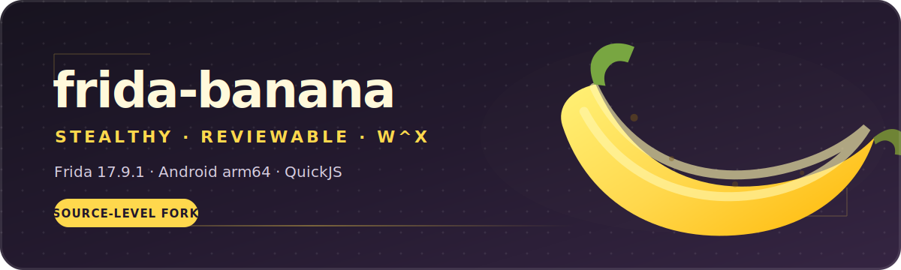

<div align="center">



<br>


**A source-level Frida 17.9.1 fork for low-footprint Android instrumentation.**

`frida-banana` removes Frida's anonymous `rwxp` footprint, gives Gum allocations ART-like names,
and replaces obvious runtime identifiers—without patching the target application's `.text` pages.

[Download](#-download) · [Build](#-build-from-source) · [Use](#-use-it) · [Verify](#-verify-on-device) · [Technical notes](STEALTH_FRIDA_BUILD_RESULT.md)

</div>

> [!TIP]
> **Want the ready-to-run server?** Get it from the
> [**Frida Banana 17.9.1 release**](https://github.com/enchantedglycerin/frida-banana/releases/tag/17.9.1),
> then verify its SHA-256 below. Prefer auditable source? The complete Android arm64 build recipe
> is included in this README.

## 🍌 What makes it banana

| Patch group | What changes | Runtime result |
|---|---|---|
| **W^X memory** | Android reports `GUM_RWX_NONE`; Gum writes into `RW` pages and commits them as `RX`. XOM softening uses `RX`, never `RWX`. | No Frida-created writable + executable mapping. |
| **ART-like VMAs** | Gum's anonymous mappings are labeled through `PR_SET_VMA_ANON_NAME`. | `[anon:dalvik-LinearAlloc]` and `[anon:dalvik-jit-code-cache]` instead of unnamed mappings. |
| **Neutral threads** | Obvious Gum/Frida worker names are replaced at their source. | Names such as `gc-worker`, `gc-daemon`, and `gc-container`. |
| **Neutral agent memfd** | The injected agent resource is renamed consistently across creation and lookup paths. | `/memfd:art-jit-cache-64.so (deleted)` instead of `frida-agent-64.so`. |

The implementation stays deliberately small and reviewable:

- [`stealth-frida-gum.patch`](stealth-frida-gum.patch) — memory policy, VMA labels, and scheduler names
- [`stealth-frida-core.patch`](stealth-frida-core.patch) — agent thread and memfd names
- [`stealth-patches-BASE-COMMITS.txt`](stealth-patches-BASE-COMMITS.txt) — pinned upstream commits

## 🧭 Design boundaries

<table>
<tr>
<td width="50%" valign="top">

### ✅ This fork does

- Preserve the Frida **17.9.1** protocol identity
- Force Gum's Android code path to follow **W^X**
- Rename Gum-owned anonymous regions and visible workers
- Keep the capture helper off target `.text` pages through hardware breakpoints
- Pin the root and vendored subprojects to version **17.9.1**

</td>
<td width="50%" valign="top">

### 🚫 This fork does not

- Promise universal invisibility against every detector
- Cover mappings created by V8's independent JIT allocator
- Commit generated server binaries into the Git source tree
- Bundle the Android NDK or host-side Frida tools
- Replace device-specific acceptance testing

</td>
</tr>
</table>

## 📦 Download

Prebuilt Android arm64 artifacts are published on the
[**17.9.1 release page**](https://github.com/enchantedglycerin/frida-banana/releases/tag/17.9.1).

| Artifact | Size | SHA-256 |
|---|---:|---|
| [`stealth-frida-server-17.9.1-android-arm64`](https://github.com/enchantedglycerin/frida-banana/releases/download/17.9.1/stealth-frida-server-17.9.1-android-arm64) | 53,078,936 bytes | `927642ad43f6ce2507ce61850b193aea8b49963fdb8a199c20c962c936254678` |
| [`stealth-frida-server-17.9.1-android-arm64.gz`](https://github.com/enchantedglycerin/frida-banana/releases/download/17.9.1/stealth-frida-server-17.9.1-android-arm64.gz) | 23,349,041 bytes | `faada68891359944243d7dd69eff7cc5529a3656881564f0771fbad2fb06b991` |

Verify before running:

```bash
sha256sum stealth-frida-server-17.9.1-android-arm64
```

> [!NOTE]
> These hashes identify the published reference artifacts. A local build should be compared
> against them, but byte-for-byte reproduction from a fresh flattened clone has not yet been
> completed across the documented toolchain.

## 🛠 Build from source

### Requirements

| Dependency | Required version |
|---|---|
| Android NDK | **r29** (`29.0.14206865` for the reference build) |
| Node.js | **20.x** |
| Meson / Ninja | Meson **1.11.2** used for the reference build |
| Host | Linux or WSL2 |

```bash
git clone https://github.com/enchantedglycerin/frida-banana.git
cd frida-banana

export ANDROID_NDK_ROOT="$HOME/android-ndk-r29"
export PATH="$HOME/opt/node/bin:$HOME/.local/bin:$PATH"

./configure --host=android-arm64
deps/toolchain-linux-x86_64/bin/ninja \
  -C build \
  subprojects/frida-core/server/frida-server
```

The stripped server is written to:

```text
build/subprojects/frida-core/server/frida-server
```

The committed version override keeps root and standalone vendored builds at `17.9.1`, even in a
source archive without Git metadata.

## 🚀 Use it

### 1. Install matching host bindings

```bash
python -m pip install "frida==17.9.1" frida-tools
```

### 2. Push and start the server

Use either the downloaded binary or your local build:

```bash
# Published release binary
adb push stealth-frida-server-17.9.1-android-arm64 /data/local/tmp/.gc-srv

# Local build alternative:
# adb push build/subprojects/frida-core/server/frida-server /data/local/tmp/.gc-srv

adb shell su -c 'chmod 755 /data/local/tmp/.gc-srv'
adb shell su -c '/data/local/tmp/.gc-srv -l 127.0.0.1:17173 &'
```

### 3. Attach with QuickJS

```bash
# Minimal presence / mapping probe
frida -H 127.0.0.1:17173 --runtime=qjs \
  -f com.example.app \
  -l presence_only.js

# Project-specific capture harness (configured for libgame.so / OFF_CIPHER)
frida -H 127.0.0.1:17173 --runtime=qjs \
  -f com.devsisters.crg \
  -l capture_hwbp.js
```

`capture_hwbp.js` is an example harness, not a universal tracer. For another target, update the
module name, `OFF_CIPHER`, calling convention, and captured argument sizes before using it.

> [!WARNING]
> Use `--runtime=qjs`. V8 has its own JIT allocator outside the Gum changes in this fork and may
> create executable mappings that defeat the low-footprint objective.

## 🔍 Verify on device

Never infer success from one filtered grep. Establish a clean application baseline, inject the
agent, and compare **all** writable + executable mappings:

```bash
PID="$(pidof com.example.app)"

# Every writable + executable mapping, named or unnamed
awk '$2 ~ /rwx/ { print }' "/proc/$PID/maps"

# Injected agent mapping
grep 'art-jit-cache' "/proc/$PID/maps"

# Visible thread names
for COMM in /proc/"$PID"/task/*/comm; do cat "$COMM"; done
```

A proper acceptance run should confirm:

1. The post-injection `rwx` count equals the clean application baseline.
2. Gum code mappings are `r-xp`, not `rwxp`.
3. The agent memfd and thread names match the neutral names above.
4. The target remains stable for at least 60 seconds under the intended workload.
5. `capture_hwbp.js` reaches `[CAPTURED]` without modifying target `.text` pages.

See [`STEALTH_FRIDA_BUILD_RESULT.md`](STEALTH_FRIDA_BUILD_RESULT.md) for the complete device
procedure, failure interpretation, and upstream rebuild recipe.

## 🗂 Repository map

```text
frida-banana/
├── capture_hwbp.js                  # resilient hardware-breakpoint capture harness
├── presence_only.js                 # minimal injection / mapping probe
├── stealth-frida-gum.patch          # W^X, VMA labels, scheduler names
├── stealth-frida-core.patch         # agent thread and memfd names
├── stealth-patches-BASE-COMMITS.txt # pinned upstream bases
├── STEALTH_FRIDA_BUILD_RESULT.md    # technical rationale and acceptance procedure
├── docs/assets/                     # banana-themed project artwork
├── subprojects/                     # vendored Frida 17.9.1 source tree
└── releng/                          # vendored Frida build tooling + version pin
```

## ⚖️ Scope and responsibility

This project is intended for authorized research, interoperability, debugging, and analysis on
software and devices you are permitted to inspect. You are responsible for complying with the
rules and laws that apply to your environment.

## 🌱 Credits

Built on [Frida](https://frida.re/) and the work of its contributors. See
[`CONTRIBUTORS.md`](CONTRIBUTORS.md) for repository credits.

Licensed under the **wxWindows Library Licence 3.1**; see [`COPYING`](COPYING).

<div align="center">

**Stay curious. Keep it yellow. 🍌**

</div>
